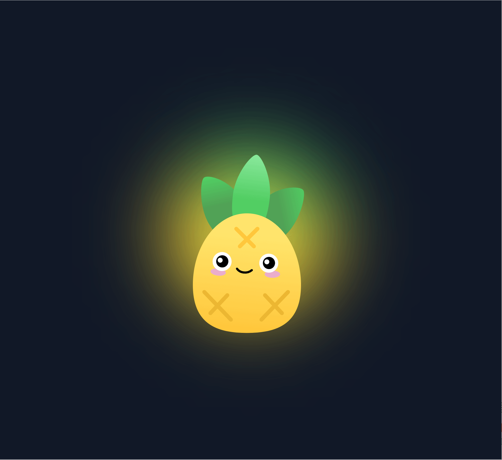
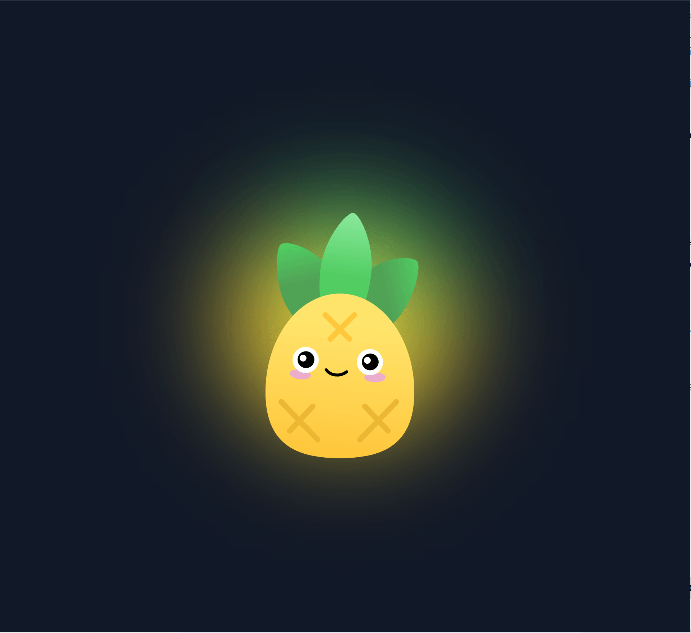
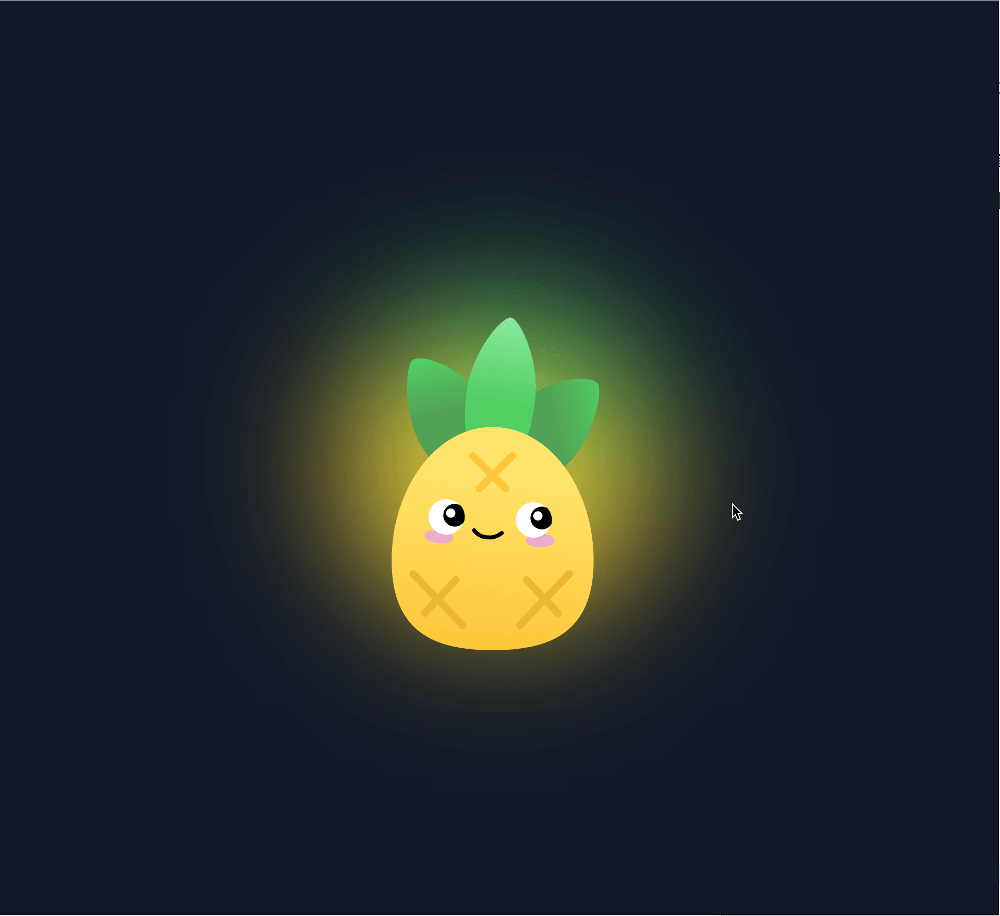
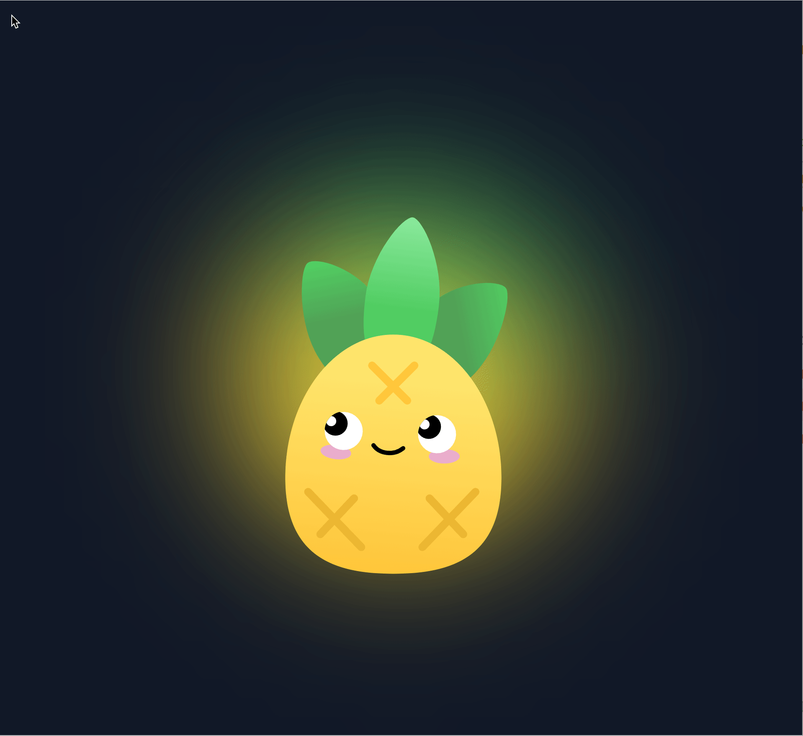

# interactive-pineapple

Recreated the interactive pineapple from pinia website  
复刻了 Pinia 官网上的那个可以互动的小菠萝

一些交互参数都是 1:1 还原

# 复现步骤

小菠萝主要的交互效果有：
* 眨眼
* 眼球跟随鼠标
* 一定时间鼠标不移动眼球归位


**眨眼**

先去获取眨眼的间隔，使用浏览器控制台的性能工具进行录制分析，我们录制眨眼开始到结束的一段，然后事件日志里把计时器过滤出来

其中一个计时器：


另外两个计时器：


这三个计时器的脚本事件的堆栈轨迹里可以看出，反复的`setTimeout` 调用 `w`，应该是一个用 `setTimeout` 实现的递归

点开堆栈轨迹的函数所在行 `@theme.62an5gDA.js:6:7264`


这段代码用到了 `ri`、`ai`、`Ze` 变量，我们往上找找这三个变量的定义


上面那段 `setInterval` 即可转换成：

```javascript
setInterval(() => {
    let blinkState = 0;

    function blinkHandler() {
        blinkState++
        if (blinkState % 2) {
            blinking()
            setTimeout(blinkHandler, 170)
        } else {
            if (blinkState < 4) {
                blinking()
                setTimeout(blinkHandler, 100)
            } else {
                blinking()
            }
        }
    }

    setTimeout(blinkHandler, 0)
}, 4000);
```

效果对比：





**眼球跟随鼠标**

眨眼的函数完成了，接着找眼球跟随鼠标相关的代码

性能工具开始录制后，鼠标随便移动一段，然后事件日志里找 `mousemove` 事件相关的


点堆栈轨迹的`Qr.te@theme.62an5gDA.js:6:5090`，跳转到函数调用的所在行


这里用到了 `l` 函数，上下文找找 `l` 在哪定义


这里盲猜一波，`n` 的 `x` 和 `y` 应该就是 `MouseEvent` 的 `x` 和 `y`

代码转换下：

```javascript
document.body.addEventListener("mousemove", (e) => {
    this.move(e.clientX, e.clientY)
})
```

以及：

```javascript
const root = document.querySelector(selector)
this.rect = root.getBoundingClientRect()

const cx = this.rect.left + this.rect.width / 2
const cy = this.rect.top + this.rect.height / 2

// 鼠标相对单个眼球中心位置
const x = Math.min(1, Math.max(-1, (mouseX - cx) / 150))
const y = Math.min(1, Math.max(-1, (mouseY - cy) / 100))
```

但明显的 `x` 和 `y` 最终的值是在 1 到 -1 之间，所以并不是绝对值，还得去 CSS 中找找

在控制台元素选择中，眨眼会反复的移除和添加元素，导致难以观测元素的样式，我们先在眨眼的计时器函数里打断点


然后选择眼球元素


CSS 变量值也是 1 到 -1 区间，最终呈现是：

```css
.eye-left .eyeball {
    transform: translate(12px, -10px);
}
```

所以我们只要把 x 和 y 代入即可：

```javascript
this.eyeball.style.translate = `calc(12px * ${x}) calc(10px * ${y})`
```

有了鼠标位置对眼球 XY 的映射后 ，得继续找一个动效实现，因为 Pinia 的菠萝是有一个缓动效果的 ，直接看事件日志里 `mousemove` 的下一条


这里的 `m` 应该是动画函数，这个动画函数里面调用了 `Fr`，然后找找该函数的定义


继续深挖 `Fr` 和 `ze` 函数


这里在 `ze` 函数上面一点无意间看到了 `vue-use-spring` 库，作用是在 Vue 中使用 Spring 动效（弹簧效果）


浏览器控制台里看到的打包后的 `ze` 函数源码与这个库源码所对应的是：

```ts
// stepper is used a lot. Saves allocation to return the same array wrapper.
// This is fine and danger-free against mutations because the callsite
// immediately destructures it and gets the numbers inside without passing the
// array reference around.
const reusedTuple: [number, number] = [0, 0]

export function stepper(
    secondPerFrame: number,
    x: number,
    v: number,
    destX: number,
    spring: SpringConfig
): [number, number] {
    // Spring stiffness, in kg / s^2

    // for animations, destX is really spring length (spring at rest). initial
    // position is considered as the stretched/compressed position of a spring
    const Fspring = -spring.tension * (x - destX)

    // Damping, in kg / s
    const Fdamper = -spring.friction * v

    const a = (Fspring + Fdamper) / (spring.mass || 1)

    const newV = v + a * secondPerFrame
    const newX = x + newV * secondPerFrame

    const precision = spring.precision || 0.01

    if (Math.abs(newV) < precision && Math.abs(newX - destX) < precision) {
        reusedTuple[0] = destX
        reusedTuple[1] = 0
        return reusedTuple
    }

    reusedTuple[0] = newX
    reusedTuple[1] = newV

    return reusedTuple
}
```

物理弹簧公式：
$$
\begin{cases}
a = \frac{-k (x - x_\text{target}) - c v}{m} \\
v_\text{new} = v + a \cdot dt \\
x_\text{new} = x + v_\text{new} \cdot dt
\end{cases}
$$

源码中对应的就是：

| 变量              | 弹簧公式              |
|-----------------|-------------------|
| x               | x                 |
| v               | v                 |
| destX           | $x_\text{target}$ |
| spring.tension  | 弹簧劲度              |
| spring.friction | 阻尼系数              |
| spring.mass     | 质量                |
| secondPerFrame  | 时间步长              |

我在查看这个库的源码时发现了不单单是只实现弹簧效果，还有防止性能不够时的插帧（下一帧 step 用于插值）：

```ts
const [nextIdealValue, nextIdealVelocity] = stepper(
    msPerFrame / 1000,
    newIdealValue,
    newIdealVelocity,
    value,
    spring
)

// @ts-ignore
currentValues[key] =
    newIdealValue + (nextIdealValue - newIdealValue) * currentFrameCompletion
// @ts-ignore
currentVelocities[key] =
    newIdealVelocity +
    (nextIdealVelocity - newIdealVelocity) * currentFrameCompletion
// @ts-ignore
idealValues[key] = newIdealValue
// @ts-ignore
idealVelocities[key] = newIdealVelocity
```

但我们本次并未使用 Vue 框架来复现这个可互动的小菠萝，把这个库改成普通的 js 形式也不太现实，直接找 ChatGPT 要了一份

```javascript
const noWobble = {
    tension: 170,
    friction: 26,
    mass: 1,
    precision: 0.01,
}

function stepper(secondPerFrame, x, v, destX, spring) {
...
}

function createSpring(initialValue, springConfig = noWobble, {onRest} = {}) {

    function animate() {
        animationId = raf(() => {

        ...

            animate()
        })
    }

    function setTarget(newTarget) {
    ...
    }

    function getValue() {
    ...
    }

    return {
        setTarget,
        getValue,
        stop: () => animationId && cancelRaf(animationId),
    }
}

```

代码就不放全了，可以去 GitHub 仓库里看
效果对比：




**眼球归位**

Pinia 的小菠萝是一段时间鼠标没移动就归位，可以在空闲帧状态（无动画帧触发）结束后的一小段区间里找计时器


接着往前找安装计时器（ID 是 14423 的）事件


3 秒鼠标不动，眼球归位（x 和 y 归 0），代码实现就是：

```javascript
this.timer && clearTimeout(this.timer)
this.timer = setTimeout(() => {
    this.left.homing()
    this.right.homing()
}, 3000)
```

效果对比：




效果有点不太对劲，可能有些参数对不上

我猜的是运行时用的不是这个默认的 `SpringConfig`（变量 `Nr`）


到 `ze` 函数处打断点，因为 `vue-use-spring` 库的源码中，`stepper` 函数最后一个参数 `spring` 就是接收 `SpringConfig` 结构的对象

这里参数 `o` 就是一个 `SpringConfig`，值跟 `Nr` 明显不一致


用运行时的值替换过来：

```javascript
// 旧
this.spring = createSpring({x: 0, y: 0}, {
    mass: 1,
    tension: 170,
    friction: 26,
    precision: 0.001
})

// 新
this.spring = createSpring({x: 0, y: 0}, {
    mass: 1,
    tension: 120,
    friction: 34,
    precision: 1
})
```

效果再次对比




完美
